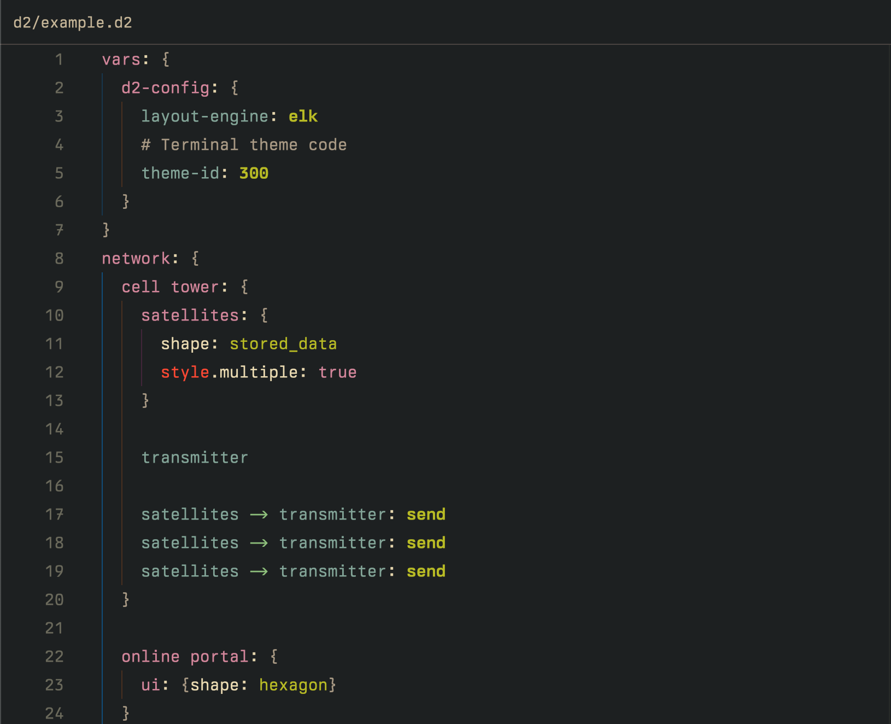

# D2 for Zed

An extension that adds D2 support for Zed.

Learn more about D2 at <https://d2lang.com>

## Acknowledgments

- Tree-sitter grammar by Dmitriy Pleshevskiy: [tree-sitter-d2](https://git.pleshevski.ru/pleshevskiy/tree-sitter-d2)
